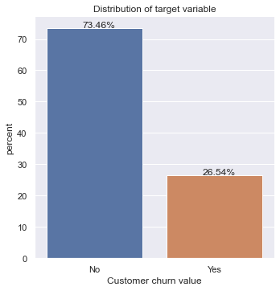
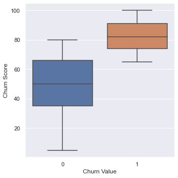
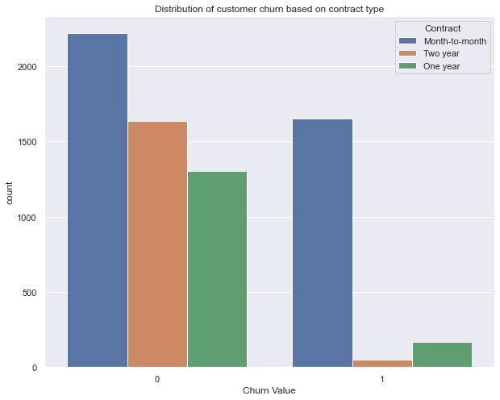
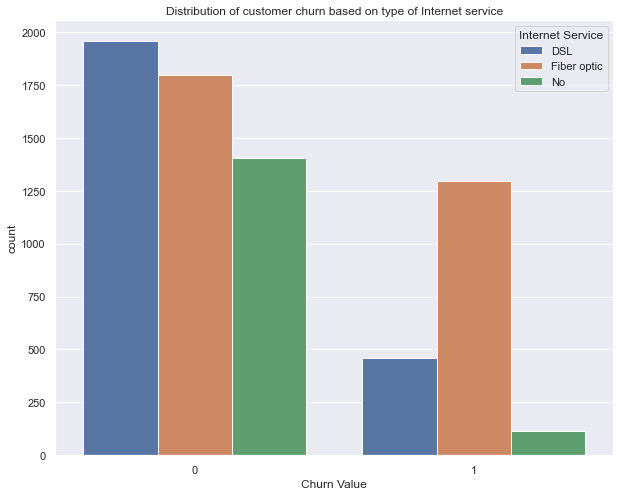
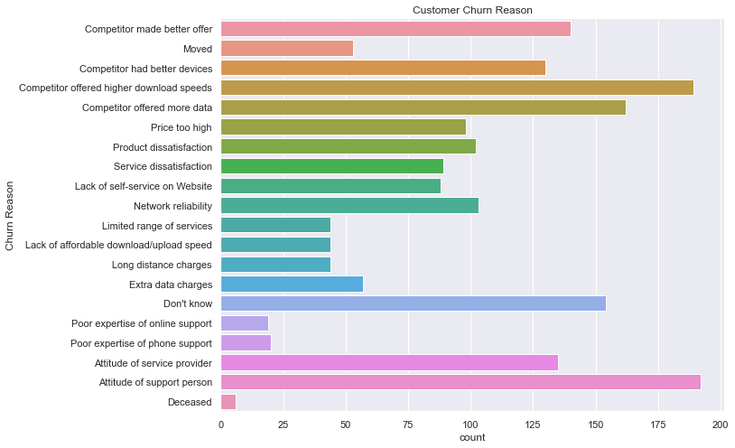
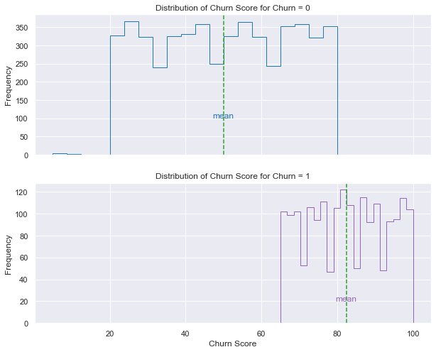

Customer_Churn_Prediction
==============================

The ability to accurately predict the customers who have a higher probability to churn is critical in customer retention.  Careful analysis of available data on customers can reveal any trends or potential issues that needs to be addressed. Using this, we can also build machine learning models that can predict probability of customer churn. This helps an organization to devise suitable retention measures as churn rate is an important factor that directly affects the revenue.

Project Organization
------------

    ├── LICENSE
    ├── Makefile           <- Makefile with commands like `make data` or `make train`
    ├── README.md          <- The top-level README for developers using this project.
    ├── data
    │   ├── external       <- Data from third party sources.
    │   ├── interim        <- Intermediate data that has been transformed.
    │   ├── processed      <- The final, canonical data sets for modeling.
    │   └── raw            <- The original, immutable data dump.
    │
    ├── docs               <- A default Sphinx project; see sphinx-doc.org for details
    │
    ├── models             <- Trained and serialized models, model predictions, or model summaries
    │
    ├── notebooks          <- Jupyter notebooks. Naming convention is a number (for ordering),
    │                         the creator's initials, and a short `-` delimited description, e.g.
    │                         `1.0-jqp-initial-data-exploration`.
    │
    ├── references         <- Data dictionaries, manuals, and all other explanatory materials.
    │
    ├── reports            <- Generated analysis as HTML, PDF, LaTeX, etc.
    │   └── figures        <- Generated graphics and figures to be used in reporting
    │
    ├── requirements.txt   <- The requirements file for reproducing the analysis environment, e.g.
    │                         generated with `pip freeze > requirements.txt`
    │
    ├── setup.py           <- makes project pip installable (pip install -e .) so src can be imported
    ├── src                <- Source code for use in this project.
    │   ├── __init__.py    <- Makes src a Python module
    │   │
    │   ├── data           <- Scripts to download or generate data
    │   │   └── make_dataset.py
    │   │
    │   ├── features       <- Scripts to turn raw data into features for modeling
    │   │   └── build_features.py
    │   │
    │   ├── models         <- Scripts to train models and then use trained models to make
    │   │   │                 predictions
    │   │   ├── predict_model.py
    │   │   └── train_model.py
    │   │
    │   └── visualization  <- Scripts to create exploratory and results oriented visualizations
    │       └── visualize.py
    │
    └── tox.ini            <- tox file with settings for running tox; see tox.readthedocs.io

--------

<small>Project based on the <a target="_blank" href="https://drivendata.github.io/cookiecutter-data-science/">cookiecutter data science project template</a>. #cookiecutterdatascience</small>

=======

## 1. Data
Telco is a fictional telecommunications company that provided home phone and Internet services to customers in California in Q3. The company is looking to identify any interesting patterns among the customers who left the company in Q3 so that they can implement strategies to retain more customers in the next quarter. The following data are used in the analysis and modelling.

> * [IBM Accelerator catalog](https://community.ibm.com/accelerators/catalog/content/Telco-customer-churn)
    This dataset includes demographics information about customer such as gender, dependents, etc. as well as specific information on type of services the customer have with the company. The target column contains the churn info. It has the value 1 if the customer has left the company. Otherwise, it has the value of 0.
> * [United States zip codes database](https://www.unitedstateszipcodes.org/ca/#zips-list)
    This dataset maps the zip codes to county name. This helps in better management of categorical feature without losing much information on customer's geographic location.
    
## 2. Method

## 2.1 Data Cleaning
[Data Cleaning Report](https://github.com/VargheseTresa/Capstone_Customer_Churn_Prediction/blob/main/notebooks/1.0_data_wrangling.ipynb)

[Data preprocessing Report](https://github.com/VargheseTresa/Capstone_Customer_Churn_Prediction/blob/main/notebooks/3.0_preprocessing.ipynb)

The dataset includes 7043 observations about telecommunication customers from California. Out of the 7043 customers, 27% of the customers left the company in the end of Q3. Each observation contains various columns related to the customer and the type of services they use. 

**Handling of missing values:**

Only the columns `Churn Reason` and `Total Charges` columns have missing values. 
* `Total Charges` column has 11 missing values. This column is correlated with `Monthly Charges` and `Tenure Months` column. Hence we can safely drop this column. 
* `Churn Reason`  values are missing only for those observations with `Churn Label` = No. Thus it represents the customers that are still with the company and it definitely makes sense for those customers to have null value for `Churn Reason` column. Thus it is an attribute whose values cannot be obtained at the time of prediction. To avoid data leakage, we drop this column as well
There are no missing values in any columns except `Churn Reason`. This column has a value only for those customers who left the company. The preprocessing steps performed on other columns are described below.

**Preprocessing and feature engineering**
* **Preprocessing of numerical columns:** The identified numerical columns are `Tenure Months`, `Monthly Charges`, `Total Charges`, `Churn Score` and `CLTV`. Out of these, Monthly Charges and Total Charges are highly correlated. Hence, we keep only one of these columns. Also, as all the columns are in different scales, they are normalized to be on the same scale. This prevents columns with high magnitude such as CLTV from dominating over other low magnitude columns.

* **Preprocessing of categorical columns:** The low cardinality categorical columns that are important to predict customer churn  identified are `Gender`,`Senior Citizen`,`Partner`,`Dependents`,`Phone Service`,`Multiple Lines`,`Internet Service`,`Online Security`,`Online Backup`,`Device Protection`,`Tech Support`,`Streaming TV`,`Streaming Movies`,`Contract`,`Paperless Billing` and `Payment Method`. The categorical values in these columns are encoded using one-hot encoding technique.

* **Handling of customer location information:** The data set includes customers from the state of California spread over 1652 unique postal codes and 1129 unique cities. As they are high cardinality values, these columns are dropped. The zip code values are mapped to corresponding county values using the United States Zip Codes database. The county values are then encoded using Label Encoder. As we can represent customer's geographic information in this way, we also delete the Latitude and Longitude columns.

## 4. EDA
[EDA Report](https://github.com/VargheseTresa/Capstone_Customer_Churn_Prediction/blob/main/notebooks/2.0_EDA.ipynb)

**Analysis of target variable**

It appears that we have an imbalanced target class with approximately 27% customers with churn = 1 class and 73% customers with churn = 0 class. Also, customers who churn have relatively high churn score value or on month-to-month contract as depicted below.

Some other interesting relationships identified during EDA are shown below.

Approximately 70% of the customers who left the company had Fibre Optic Internet service. This along with above data which indicates that better internet service from competitor could be a significant factor leading to customer churn.

### Statistical estimation of average churn score of customers who churn

To determine how useful is the feature `churn score` in predicting the probability of customer churn, we look at the distribution of churn score and mean churn score for customers who churn and who do not churn.

It is evident that customers who churn have higher churn score. Bootstrapping technique is applied to statistically estimate the confidence interval for the difference in mean churn score for customers who churn and customers who do not churn. The 95% confidence interval of the difference between mean churn scores of customers from both categories is estimated to be between 31.74 and 33.01.

## 5. Algorithms & Machine Learning

[ML Notebook](https://github.com/VargheseTresa/SpringBoard/blob/main/CAP2/CAP2_modelling.ipynb)

## 6. Predictions
[Final Predictions Notebook](https://colab.research.google.com/drive/1vLkoW_4SYessy_igmJxlVz_jEPlgJ06v)

### References

Not all the work in this notebook is original. Some parts were borrowed from online resources. I take no credit for parts that are not mine. They were soley used for illustration purposes.

1. https://www.statisticshowto.com/welchs-test-for-unequal-variances/
2. https://medium.com/@sosterburg/mapping-data-with-folium-356f0d6f88a9

### Resources used
* [GeoJSON Source](https://github.com/OpenDataDE/State-zip-code-GeoJSON/blob/master/ca_california_zip_codes_geo.min.json)
    The GeoJSON file is downloaded from the above mentioned repository.
>>>>>>> 1af9211545140cc748322f8f6b22609b75bb6298
